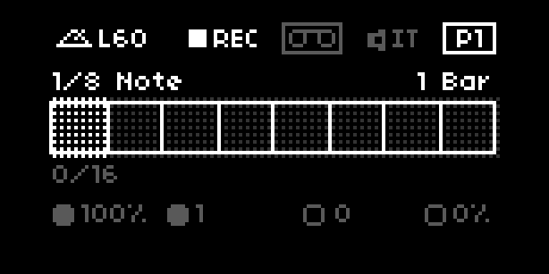
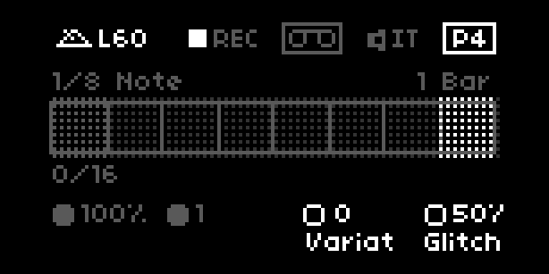
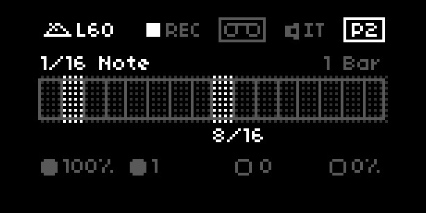

# B-B-B-B-Beat Guide
---

v0.9.4

## Introduction

The Beat Repeat plugin from Ableton is notoriously confusing. This guide is a humble attempt to demistify functionality and clarify expectations. From the [Ableton Manual](https://www.ableton.com/en/manual/live-audio-effect-reference/#22-4-beat-repeat) they describe Beat Repeat as such: "*Beat Repeat allows for the creation of controlled or randomized repetitions of an incoming signal.*" 

### Differences Norns v. Ableton

For this Norns port, there are differences from the Ableton version. It's important to note I am reverse engineering this based on experience and observation, so functionality is as 1:1 as I can get. Also, the glitching params are not present in the Ableton version.

### Parameters

**UI params**

These params are vaisible on the display of Norns and can be directly adjusted using the UI and knobs.

| Param     | Description                                                             | Values |
| ---- | ------------------------------------------------------------ | ---- |
| `Tempo` | This can be set either manually or synced to sources as defined within Norns [`CLOCK` menu](https://monome.org/docs/norns/clocks/#parameters). | 20 – 300 |
| `Interval`     | This controls how often new material is captured and starts “repeating” it. This is always synced to the song’s tempo. | 1/256 notes – 4 bars |
| `Grid` | This controls the size of each repeated slice. Large grid values create rhythmic loops, and small values create sonic artifacts. | 1/256 notes – 4 bars |
| `Offset` | This shifts the record starting point, defined by given interval (1/16th notes). For example, if the interval is set to “1 bar” and offset is set to 8/16, the material will be captured for repetition once per bar on the third beat (in other words, halfway through the bar, or eight-sixteenths of the way). | 0/16 notes – 15/16 notes |
| `Chance` | This determines the likelihood of repetitions actually taking place when Interval and Offset ”ask” for them. If Chance is set to 100 percent, repetitions will always take place at the given Interval/Offset time; if set to zero, there will be no repetitions and input audio is passed through without effect. | 0 – 100% |
| `Gate` |  This defines the total length of all repetitions in sixteenth notes. For example, if the gate is set to ”4/16”, the repetitions will occur over the period of one beat (quarter note), starting at the position defined by Interval and Offset. | 1–15/16, 1–4 bars |
| `Variation` | This modifies the grid size (using length defined by grid) change randomly. If variation is set to zero, the grid size is fixed. | 0 – 10 |
| `Glitch` | This determines the likelihood of glitching occurring and how intense the glitch effect will be. | 0 – 100% |
| `Mode` | `Live`mode uses live audio input and `Sample` mode uses a chosen sample file (loading is done via the params menu). | `Live` or `Sample` |
| `Output mode` | This determines the output signal `Mix` is a combination of the original input and repeats, `Insert` mutes the original input when repeats are played, otherwise it passes through, and `Gate` only plays the repeats. | `Mix`, `Insert`, or `Gate` |

**Hidden params**

These params are only listed within params menu.

| Param     | Description                                                             | Values |
| ---- | ------------------------------------------------------------ | ---- |
|  `Glitch UI` | Toggle the glitching of the UI, this causes (intended) visual glitches more frequently and “violently” as the `Glitch` param gets closer to 100 | `yes` or `no` |
|  `Glitch stutter` | Toggle an audio stutter (e.g. random muting of audio) the likelihood of stutter occuring increases based on the `Glitch` command. | `yes` or `no` |

### Modes

B-B-B-B-Beat supports both live audio and loading of samples. Changing modes can be on screen within page 4 (`P4`) using encoder 2 `E2` to change or within the params menu.

| Live mode | Sample mode |
| ---- | ----------- |
|   This icon indicates that live audio mode is active and when and how long recording of material takes place is determined by `Interval`, `Grid`, and `Offset` params. |  This icon indicates that sample mode is active. Samples can be loaded via the params menu or when on page 4 (`P4`) by pressing key 3 (K3). |
| |  If a sample is loaded, a rectangle is drawn around the icon.  |

### Midi

All of the above listed params can also be controled with Midi CC via `MAP` within params menu. See Norns [documentation on mapping](https://monome.org/docs/norns/play/#map) for more details.

If you're using any clock sync method (except for `MIDI`) you will have to manually sync to the first beat by pressing `K2`. If you're using `MIDI` sync, B-B-B-B-Beat will automatically sync to the 1st beat whenever a Midi `start` or Midi `stop` command is sent. 

*Note: Norns is a USB Midi host and your computer (i.e. Ableton, etc.) is a USB Midi host. In order sync two Midi hosts you need a special connector, see [this discussion](https://llllllll.co/t/how-to-sync-two-usb-midi-hosts/15893) for details and solutions.*

---

## Examples

The following examples are crafted to help you understand (hopefully) and get started with B-B-B-B-Beat. Use these as a starting point. This script is great for experimentation and I would encourage you to do so. Audio source doesn't matter, I personally use this for live audio, but any of the following can be used with samples as well, just be sure to use the appropriate `Mode `.

For the following examples, I've created 4 bars of 1/2 notes as live audio (in Ableton). 

### Example 1: Basic Repeat

We'll configure Beat Repeat to record material once per bar and repeat the input every eighth note. These notes will be repeated from the first beat of the given pattern with no offset. 

| Param     | Value     |
| --------- | --------- |
| `Interval` | 1 Bar |
| `Grid` | 1/8 Note |
| `Offset` | 0/16 |
| `Chance` | 100% |
| `Gate` | 1 Bar |
| `Variation` | 0 |
| `Glitch` | 0% |
| `Output mode` | `Insert` |

Using the above audio input, each chord will repeat on the eigthth note. Adjusting the `Grid` param to increase the frequency of the repeats, by the given note value.  

### Example 2: Glitch Stutter

Using the same configuration as above, we'll add some intermitent glitching and stuttering. Set `Glitch` to 50% and enable `Glitch stutter`. This will mangle the audio e.g. randomly change [softcut rate](https://monome.org/norns/modules/softcut.html#rate) and mute audio. 

and in the params menu, be sure to set `Glitch stutter` to `yes`

| Param     | Value     |
| --------- | --------- |
| `Interval` | 1 Bar |
| `Grid` | 1/8 Note |
| `Offset` | 0/16 |
| `Chance` | 100% |
| `Gate` | 1 Bar |
| `Variation` | 0 |
| `Glitch` | 50% |
| `Glitch stutter` | yes |
| `Output mode` | `Insert` |

Adjusting the `Glitch` param will change the frequency and intesity of glitch and stutter effects. To just  mangle audio without stutter disable `Glitch stutter`.

### Example 3: Glitchy Madness

We'll build off of the above and add even more glitch effect. By reducing the `Interval` to 1/2 notes the record trigger will happen more frequently and the `Grid` at 1/16 note will net 8 repeats per loop. Decreasing `Chance` to 75% means that 25% of the time, no repeats will happen and the original unaffected material will be heard. (Still with me?). Lastly we'll increase `Glitch` to 75%, but disable `Glitch stutter`.

| Param     | Value     |
| --------- | --------- |
| `Interval` | 1/2 Note |
| `Grid` | 1/16 Note |
| `Offset` | 0/16 |
| `Chance` | 75% |
| `Gate` | 1 Bar |
| `Variation` | 4 |
| `Glitch` | 75% |
| `Glitch stutter` | no |
| `Output mode` | `Insert` |

### Example 4: Offset  

For the offset example, I'm using 1 bar of 1/4 notes because it's easier to understand how the offset param works.

We'll configure the repeater to loop once per bar and repeat the recorded material every 16th note. However, we're going to tell it to record audio starting half way through the bar (hence the `Offset` setting of 8/16). With the above audio example, that means only the C3 note will be repeated. 

*Note: This example assumes you are syncing the 1st beat of B-B-B-B-Beat to 1st beat of the incoming audio. [See above](#midi) for details on syncing.*

| Param     | Value     |
| --------- | --------- |
| `Interval` | 1 Bar |
| `Grid` | 1/16 Note |
| `Offset` | 8/16 |
| `Chance` | 100% |
| `Gate` | 1 Bar |
| `Variation` | 0 |
| `Glitch` | 0% |
| `Output mode` | `Insert` |

Adjusting the `Offset` param to change the recording trigger position.

---

## Additional references

- [How to use the Ableton Live BEAT REPEAT audio effect](https://obedia.com/how-to-use-the-ableton-live-beat-repeat-audio-effect/)
- [Guide to Beat Repeat from Quantize Courses](https://www.ableton.com/en/blog/guide-beat-repeat-quantize-courses/)
- [22. Live Audio Effect Reference 22.4 Beat Repeat](https://www.ableton.com/en/manual/live-audio-effect-reference/#22-4-beat-repeat)

