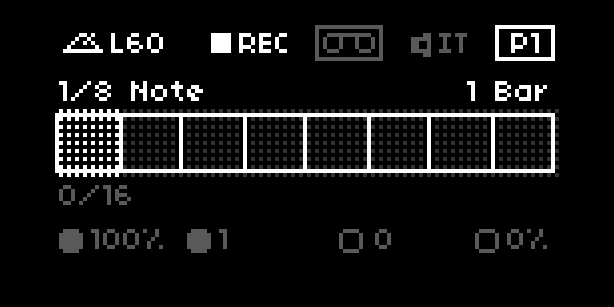

B-B-B-B-Beat
---

v0.9.4

A repeater inspired by [Ableton's Beat Repeat](https://www.ableton.com/en/blog/guide-beat-repeat-quantize-courses/) for [Norns](https://monome.org/norns), with some added glitchy inspiration from [MASF Possessed](https://www.youtube.com/results?search_query=masf+possessed)/[MWFX Judder](https://www.youtube.com/results?search_query=mwfx+judder).

This script uses live audio or samples for all of its repeating magic! Read more about the different modes in the [guide](./GUIDE.md#modes).




## Demo

I'll post a brief demo showing B-B-B-B-Beat in action, soon.


## Requirements

[Norns](https://monome.org/norns) or [Fates](https://llllllll.co/t/fates-a-diy-norns-dac-board-for-raspberry-pi/22999) or device.


## Install/Update

B-B-B-B-Beat can be installed via [Maiden's](https://norns.local/maiden) project manager.


## Params

Params be controled with Midi CC via `MAP` within params menu. For a detailed overview of the params and general functionality of this script refer to the [guide](./GUIDE.md).

| Page    | Controller                    | Description                               | Values                         |
| ------- | ----------------------------- | ----------------------------------------- | ------------------------------ |
| All     | E1                            | Change page                               |                                |
| All     | K2                            | Resync to beat 1                          |                                |
|         |                               |                                           |                                |
| 0       | E2 or E4                      | For Fates owners, BPM value can be persistently controlled using the 4th encoder, for Norns owners it's `E2` on the first page `P0`  | 20 - 300                       |
|         |                               |                                           |                                |
| 1       | E2                            | Grid length                               | 1/256 - 4                      |
| 1       | E3                            | Interval length                           | 1/256 - 4                      |
|         |                               |                                           |                                |
| 2       | E2                            | Offset amount                             | 0/16 - 15/16                   |
|         |                               |                                           |                                |
| 3       | E2                            | % repeat occurrence (chance)              | 0 - 100%                       |
| 3       | E2                            | how long to play repeats (gate)           | 1 - 15/16, 1 - 4 bars          |
| 3       | K3                            | toggle chance (temp. set 0%)              | 0%                             |
|         |                               |                                           |                                |
| 4       | E2                            | amount of Grid variance                   | 0 - 10                         |
| 4       | E3                            | % glitch occurrence                       | 0 - 100%                       |
| 4       | K3                            | toggle glitch effect (temp. set 100%)     | 100%                           |
|         |                               |                                           |                                |
| 5       | E2                            | change mode `live` or `sample`            | `live` or `sample`             |
| 5       | E3                            | Output mode                               | `mix`, `insert`, or `gate`     |
| 5       | K3                            | load new sample                           | Any valid audio file           |


## Development

[SSH](https://monome.org/docs/norns/maiden/#ssh) into your Norns/Fates, then enter the following commands in terminal.

```bash
$ cd dust/code
$ git clone https://github.com/frederickk/b-b-b-b-beat.git
```

If you want to get the latest version run these commands:

```bash
$ cd dust/code/b-b-b-b-beat
$ git fetch origin
$ git checkout primary
$ git merge origin/primary
```


## Changelog
- v0.9.x
    - Added gate and output mode
    - Added sample loading
    - Toggle live/sample mode in UI
    - Tweaked glitch effect
    - Fixed 'core' appearing in Norns list
    - Created GUIDE.md
    - Change K3 function to toggle params
- v0.8.x
    - Separated clock and redraw coroutines (https://llllllll.co/t/norns-clock/30738/77) 
    - Fixed passthrough bug when chance below 100% 🤞
- v0.7.x
    - Added offset param
    - Updated UI; more detail
    - Removed SC engine, restart no longer required on install
    - Addressed repeat (tempo/softcut) bugs
    - Updated README.md with more detail
- v0.6.x
    - Refactored codebase 
- v0.5.x
    - Fixed Glitch engine
    - Added param to toggle glitch noise (hiss)
    - Added param to toggle UI glitch
    - Added param to toggle stutter
    - Added to Maiden
- v0.4.x
    - Fixed params bug; params:add_option
    - Fixed "Chance" param; default 100%
    - Added Midi passthrough
    - Enabled param reading/writing
- v0.3.x Initial release
